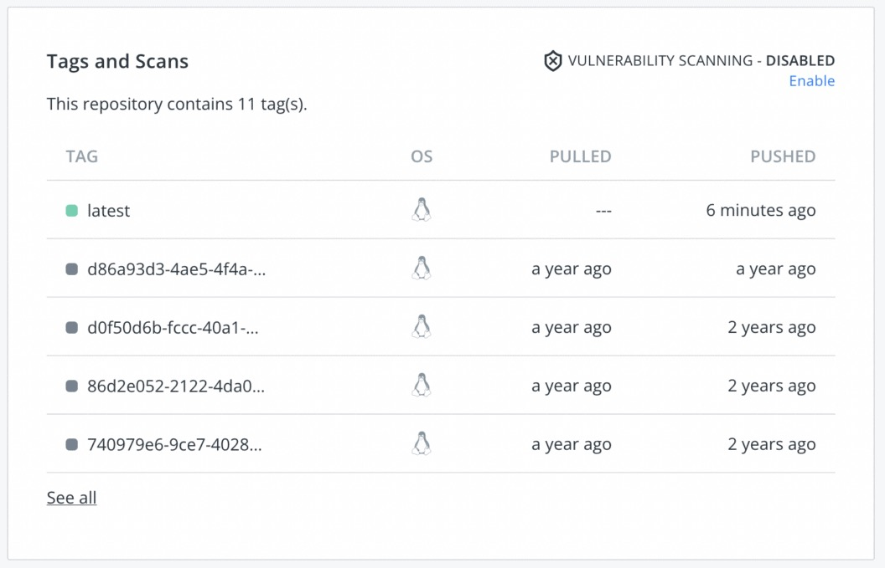
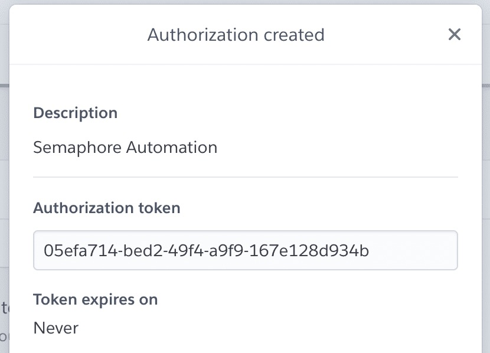
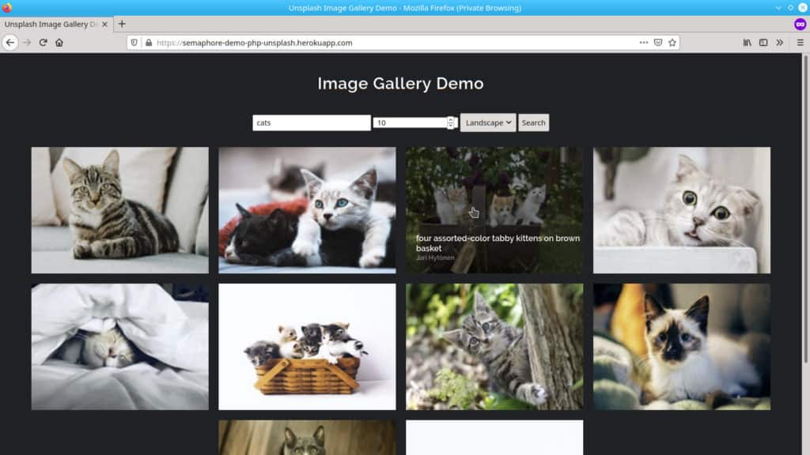
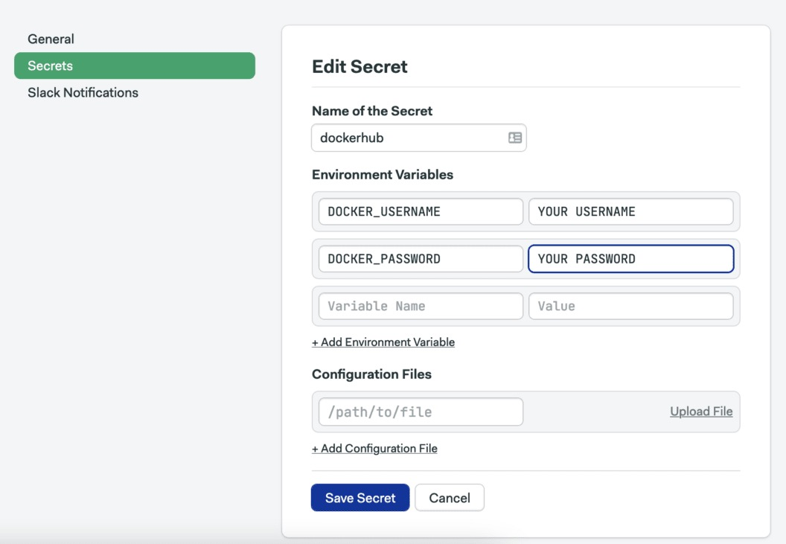
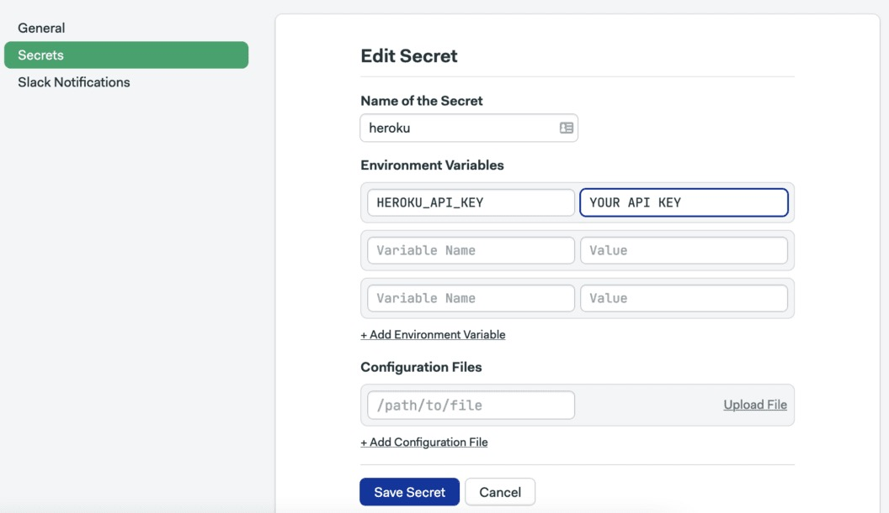
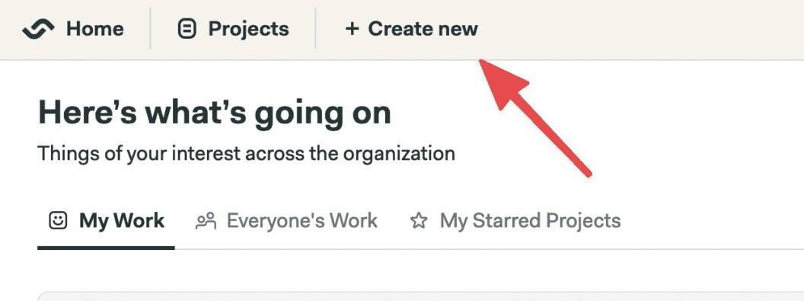
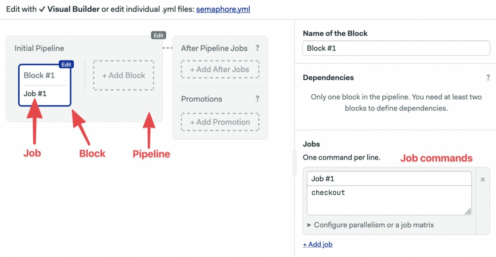
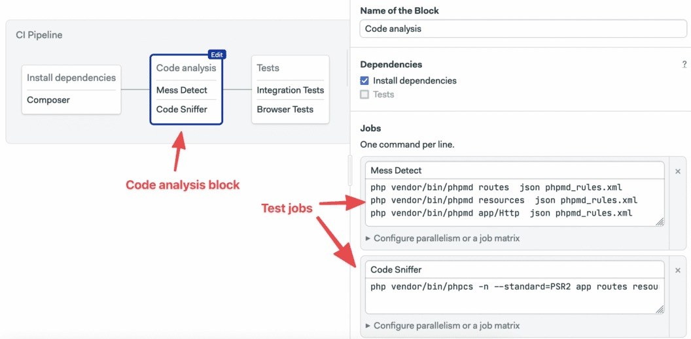
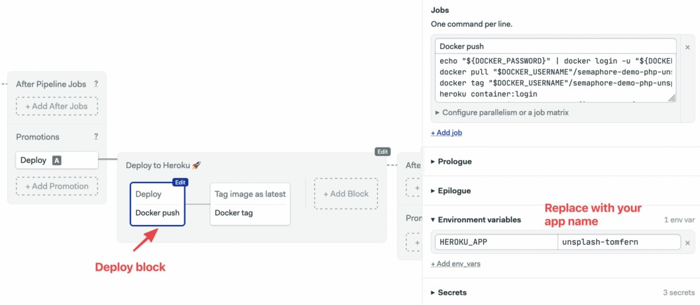
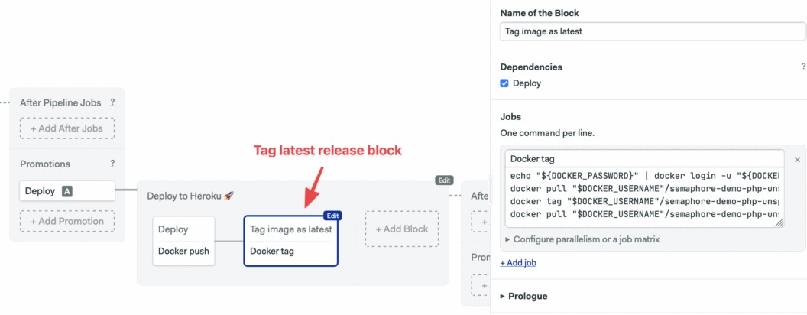

---
title: Dockerizing a PHP Application
author-meta: Rafie Younes
subtitle: semaphoreci.com
rights:  Creative Commmons Attribution-NonCommercialNoDerivatives 4.0 International
language: en-US
...

In this tutorial, you will learn what Docker is and how to use it to  create a Dockerize a PHP applications for easy deployment. You’ll learn  how to use [Continuous Integration and Deployment (CI/CD)](https://semaphoreci.com/cicd) to build and deploy the image on Heroku.

Dockerizing your PHP Application is beneficial because:

-   Containers are portable and can be deployed instantly anywhere.
-   Containers bring developers a uniform and streamlined work environment that can be easily shared.
-   Containers are the first step towards running your application with high availability with Docker Swarm or Kubernetes.

After reading the tutorial you’ll know what Docker is and how it  works. You’ll learn the ins and outs of combining Docker with PHP and  how to use Continuous Integration and Delivery to [test your application](https://semaphoreci.com/blog/20-types-of-testing-developers-should-know), build a container and deploy it. 

Specifically, you’ll learn how to:

-   Install Docker
-   Run Docker images
-   [Build](https://semaphoreci.com/blog/build-stage) customer images to run programs
-   Use  Docker Compose to set up a  dev environment
-   Run our application in Heroku
-   Test our application with [Continuous Integration](https://semaphoreci.com/continuous-integration) (CI)
-   Deploy our application with [Continous Deployment](https://semaphoreci.com/cicd) (CD)

To practice, we will start from a demo application which interacts with the [Unsplash](https://unsplash.com/) API to search for photos. The application is built with [Laravel](http://laravel.com/docs/4.2/). 

Let’s get started:

-   Install [Git](https://git-scm.com/) in your machine.
-   Sign up with [GitHub](https://github.com).
-   Go to the [demo application](https://github.com/TomFern/semaphore-demo-php-unsplash).
-   Use the **Fork** button to copy the repository in your account:

[TomFern](https://github.com/TomFern) / [semaphore-demo-php-unsplash](https://github.com/TomFern/semaphore-demo-php-unsplash)

-   Clone the repository in your machine. Open a terminal and type:

```bash
$ git clone YOUR_REPOSITORY_URL
$ cd semaphore-demo-php-unsplash
```

## Run the Demo

To run the application in your machine, you’ll need:

-   PHP 7
-   The [composer](https://getcomposer.org/) package manager.
-   One Unsplash API Key.

Getting the API Key is easy:

1.  Sign up to [Unsplash](https://unsplash.com).
2.  Go to [Applications](https://unsplash.com/oauth/applications).
3.  Select **New Application**.
4.  Review and accept the Usage Terms.
5.  Set a name for the application.
6.  Copy the **Access Key** and the **Secret Key** shown.

Create an Application API in Unsplash

1.  Prepare the application environment and install the dependencies:

```bash
$ cd src
$ composer install
$ cp .env.example .env
$ cp .env.example.unsplash .env-unsplash
$ php artisan key:generate
```

You’ll need to import the Unplash Key as environment variables:

-   Edit the `.env-unsplash` file.
-   Type in the Access and Secret Keys next to the variables.

```bash
export UNSPLASH_ACCESS_KEY="YOUR ACCCESS KEY"
export UNSPLASH_SECRET_KEY="YOUR SECRET KEY"
```

-   Source the file and start the application:

```bash
$ source .env-unsplash
$ php artisan serve
```

Open your browser on http://127.0.0.1:8000 and try it out:

App Demo

## What is Docker?

Most developers use the (W|L|M)AMP stack as a starting point, but  this environment can become overwhelming very quickly. Once you start  feeling this pain, you’ll start using a virtual environment to share and reproduce with ease.

[Docker](https://www.docker.com/) provides  us with containers that have all the virtualization capabilities we  need, while also being more lightweight than the traditional virtual  machines.

## Prerequisites

Docker can be installed on most platforms. You can install it from a binary executable, or by using the official installer.

### Installing Docker

#### Docker Desktop

If you’re using up-to-date versions of **Windows or Mac**, install [Docker Desktop](https://www.docker.com/products/docker-desktop) and you’re done.

If you are a **Linux** user, Docker packages are popular and usually included in your distribution’s repository. For example,  installing it on Ubuntu or Debian is as easy as:

```bash
$ apt-get update && apt-get install docker
```

### Docker Images

Docker is based on the concept of building images that contain the  necessary software and configuration for applications. We can also build distributable images that contain pre-configured software like an  Apache server, a caching server, MySQL database, etc. We can share our  final image on [Docker Hub](https://hub.docker.com/) to make it accessible to everyone.

#### Working with Docker Images

We can list the available images on our machine by running the `docker images` command.

```bash
$ docker images
REPOSITORY                 TAG                 IMAGE ID            CREATED             VIRTUAL SIZE
ubuntu                     14.04               91e54dfb1179        5 months ago        188.4 MB
nimmis/apache-php7         latest              bdd370e4f83b        6 months ago        484.4 MB
eboraas/apache-php         latest              0501b3fdd0c2        6 months ago        367 MB
mysql                      latest              a128139aadf2        6 months ago        283.8 MB
ubuntu                     latest              d2a0ecffe6fa        7 months ago        188.4 MB
eboraas/laravel            latest              407e2d00b528        12 months ago       404.5 MB
```

To browse the available images, we can visit [Docker Hub](https://hub.docker.com/) and run `docker pull <image>` to download them to the host machine.

### Docker Containers

We can liken a Docker image to a class definition. We define its  properties and behavior. Containers are instances created from this  class. We can create multiple instances of the same image. The `docker ps` command prints the list of containers running on the machine. We don’t  have any containers at the moment, so let’s create a new one: 

```bash
$ docker run -d php:7.4-apache
c6fbefcd630a2f4c970792af0302d9c25fe9118cec85091b04e75e7c942f5686
```

We created a new container from the [php:7-apache](https://hub.docker.com/_/php) image, and we used the `-d` flag to run the job in the background. The output hash is our container ID, we can use it to access the container and play around with it:

```bash
$ docker ps

CONTAINER ID        IMAGE               COMMAND                  CREATED             STATUS              PORTS               NAMES
c6fbefcd630a        php:7.4-apache      "docker-php-entrypoi…"   39 seconds ago      Up 38 seconds       80/tcp              laughing_lalande
```

We can see from the output that the container has an ID and a name. Let’s re-create another container and name it: 

```bash
$ docker run -tid --name="apache_server" php:7.4-apache
fdae121b23e13690fedaab4636311d8ab6b35f32fa4c68e1c98726578de35a66

$ docker ps
CONTAINER ID        IMAGE               COMMAND                  CREATED              STATUS              PORTS               NAMES
fdae121b23e1        php:7.4-apache      "docker-php-entrypoi…"   16 seconds ago       Up 15 seconds       80/tcp              apache_server
c6fbefcd630a        php:7.4-apache      "docker-php-entrypoi…"   About a minute ago   Up About a minute   80/tcp              laughing_lalande
```

Container instances are created almost instantly, you won’t notice any delay.

We can now access our container by executing the `bash` command and attaching it to our terminal:

```bash
$ docker exec -it apache_server bash

(you're now running a session inside the container)
$ /etc/init.d/apache2 status
[ ok ] apache2 is running.
```

To avoid polluting our computer with unused containers, make sure to delete old ones: 

```bash
# Delete container using ID or name
docker rm -f <container-id-or-name>

# Delete all available containers
docker rm -f $(docker ps -aq)
```

Since our container is an Apache server, it makes sense to have a way to access it through a browser. When creating an image, we need to make sure to expose it through a specific port We will cover this in more  detail in the [Dockerfiles](https://semaphoreci.com/community/tutorials/dockerizing-a-php-application#dockerfiles) section. 

```bash
$ docker run -tid \
        -p 8000:80 \
        --name apache_server \
        php:7.4-apache
```

We can get our container’s IP with `docker inspect`:

```bash
$ docker inspect \
   -f '{{range .NetworkSettings.Networks}}{{.IPAddress}}{{end}}' \
   CONTAINER_ID_OR_NAME

172.19.0.2
```

The last part is to map the Apache server to run our application  instead of the default Apache homepage. This means that we need to keep  our application folder synced with the server root folder (`/var/www/html`). We can do that using the `-v` option. You can read more about container volumes in the Docker documentation:

```bash
$ docker run -tid \
     -p 8000:80 \
     --name apache_server \
     -v YOUR_HOST_WWW_ROOT:/var/www/html \
     php:7.4-apache
```

It’s always a good idea to take a look at the image description on  the Docker Hub and read the instructions about the proper to create  containers from the image.

## Working with Dockerfiles

We mentioned earlier that everyone can make a Docker image and share  it on the Docker Hub, and that Dockerfiles are the main tool to achieve  this. We’re going to see how we can configure our own image and make it  fit our needs. You can check the [documentation](https://docs.docker.com/engine/reference/builder/) for the list of available commands.

Change one directory up to repository root:

```bash
$ cd .. 
```

The `php:7.4-apache` image set the Apache public directory to `/var/www/html`. However, in this case, following Laravel’s conventions, we need to set it to the `/var/www/public`. One way to achieve this is by setting up a  virtual host configuration. Create a file called `000-default.conf` with the following contents:

```apacheconf
# 000-default.conf

<VirtualHost *:80>
  ServerAdmin webmaster@localhost
  DocumentRoot /var/www/public

  <Directory /var/www>
    Options Indexes FollowSymLinks
    AllowOverride All
    Require all granted
  </Directory>
</VirtualHost>
```

Apache, by default, listens on port 80 (HTTP), this isn’t a problem  when running the server on your machine. But some cloud providers  require that containers use different ports.

We’ll create a script to dynamically override Apache’s port when the container starts. Create a file called `start-apache` with the following contents:

```bash
#!/usr/bin/env bash
sed -i "s/Listen 80/Listen ${PORT:-80}/g" /etc/apache2/ports.conf
sed -i "s/:80/:${PORT:-80}/g" /etc/apache2/sites-enabled/*
apache2-foreground
```

And ensure the file is executable:

```bash
$ chmod 755 start-apache
```

We’re set to create a production-ready image. Create a file called `Dockerfile`. 

We’ll use the `FROM` clause to use the offical php apache images as a starting point:

```docker
# Dockerfile
FROM php:7.4-apache
```

Now, we need `COPY` the file into the image:

```bash
...

COPY 000-default.conf /etc/apache2/sites-available/000-default.conf

...
```

Laravel requires Apache’s **mod_rewrite** plugin to be enabled, we can do this using the `a2enmod` utility. With `RUN`, we run commands inside the container:

```docker
...

RUN a2enmod rewrite

...
```

To get the source files inside the container, we can use the `COPY` command again:

```docker
...

COPY src /var/www/
RUN chown -R www-data:www-data /var/www

...
```

The last thing we need to do is to run the Apache server in the background. The `CMD` command should be used only one time in a Dockerfile, and it needs to have the following form:

```docker
CMD ["executable","param1","param2"]
```

We’ll call the start script we created earlier:

```docker
...

CMD ["start-apache"]
```

The final Dockerfile should look like this:

```docker
FROM php:7.4-apache

COPY 000-default.conf /etc/apache2/sites-available/000-default.conf
COPY start-apache /usr/local/bin
RUN a2enmod rewrite

# Copy application source
COPY src /var/www/
RUN chown -R www-data:www-data /var/www

CMD ["start-apache"]
```

### Useful Commands

Although our image is ready, we’ll go through some commands that could be useful for many projects.

What if we wanted to install [Node.js](https://nodejs.org) to manage our front-end assets? 

```bash
RUN apt-get update && \
    apt-get install nodejs
```

This will install Node.js and the npm manager in our image. We can use the `RUN` command many times inside the same Dockerfile, because Docker keeps a history for our image creation. Every `RUN` command is stored as a commit in the versioning history.

Another useful command is `ENV`. It lets us set an environment variable through the [build process](https://semaphoreci.com/blog/build-stage), and will also be present when a container is created. Be sure to check the full list of supported commands in [the documentation](https://docs.docker.com/engine/reference/builder/). 

```bash
ENV MYSQL_ROOT_PASSWORD=root
ENV MYSQL_ROOT_USER=root
```

### Building the Image

If you’ve previously pulled the base image, it will be loaded from  your computer instead of being downloaded again. This means that the  build process won’t take much time.

Our folder contains a `Dockerfile`, a `000-default.conf` and `start-apache`. The `docker build` command will build the `Dockerfile` inside the current directory: 

```bash
$ docker build .
```

If we list our Docker images now, we’ll see our new built image:

```bash
$ docker images
REPOSITORY                                                             TAG                                    IMAGE ID            CREATED             SIZE
<none>                                                                 <none>                                 19c684978566        20 seconds ago      451MB
php                                                                    7.4-apache                             0c37fe4343a5        2 weeks ago         414MB
```

Currently, our image has no name, the `-t` option let us specify the image repository and tag.

Let’s tag the image with a proper name. The syntax is:

```
$ docker tag SOURCE_IMAGE:TAG TARGET_IMAGE:TAG
```

For the image we just built, we can use:

```
$ docker tag 19c684978566 YOUR_DOCKERHUB_USER/semaphore-demo-php-unsplash
```

Using the Docker Hub username is optional. We only have to use it  when pushing the image to a registry. Since we’ll do that next, we may  as well tag the image with the final name now.

Our image is now labeled and tagged:

```bash
$ docker images
REPOSITORY                                                             TAG                                    IMAGE ID            CREATED             SIZE
tomfern/semaphore-demo-php-unsplash                                    latest                                 19c684978566        3 minutes ago       451MBMB
```

The final step is to push it to the Docker Hub. This step is  optional, but it’s still useful if we’re planning on sharing the image  and helping others with their development environment:

```
$ docker login
$ docker push YOUR_DOCKERHUB_USER/semaphore-demo-php-unsplash
```

-   After logging into our [Docker Hub](https://hub.docker.com/) account, you should see the new image in the repository:

Docker Hub images

## Docker Compose

Using terminals and remembering commands is not very practical for  creating application containers and getting started quickly. Docker  Compose uses YAML files to configure and run containers. This means that we can ship our application Dockerfile to build the environment and use a `docker-compose.yml` to run the containers.

The first step is to install Docker Composer on our machine. Follow the instructions in the [Docker documentation](https://docs.docker.com/compose/install/) before proceeding with the following steps.

We’ll use `docker-compose` to run the application inside  the container. This will speed up development as we can set up our work  environment without having to install or configure an Apache server. 

We’ll map the source code files to the container’s www-root, that way we don’t have to rebuild the Docker image while we code.

Create `docker-compose.yml` with the following contents:

```yaml
# docker-compose.yml
version: "3.9"
services:
  webapp:
    build:
      context: .
      dockerfile: ./Dockerfile.development

...
```

This will build our image using a different, development-only Dockerfile called `Dockerfile.development`. If you already have your image built locally or on the Docker Hub, you can use the `image` property instead: 

```yaml
# docker-compose.yml
version: "3.9"
services:
  webapp:
    image: YOUR_DOCKERHUB_USER/semaphore-demo-php-unsplash
```

In the `webapp` service, we’ll specify the exposed ports,  volumes, and optionally some environment variables. 

```yaml
...

 ports:
      - "8000:80"
    volumes:
      - ./src:/var/www
    environment:
      - APP_KEY=SomeRandomStringToAddSecurity123
      - APP_ENV=development
      - APP_DEBUG=true
      - APACHE_RUN_USER=apache-www-volume
      - APACHE_RUN_GROUP=apache-www-volume
      - UNSPLASH_ACCESS_KEY=${UNSPLASH_ACCESS_KEY}
      - UNSPLASH_SECRET_KEY=${UNSPLASH_SECRET_KEY}
```

The final `docker-compose.yml` looks like this:

```yaml
version: "3.9"
services:
  webapp:
    build:
      context: .
      dockerfile: ./Dockerfile.development
    ports:
      - "8000:80"
    volumes:
      - ./src:/var/www
    environment:
      - APP_KEY=SomeRandomStringToAddSecurity123
      - APP_ENV=development
      - APP_DEBUG=true
      - APACHE_RUN_USER=apache-www-volume
      - APACHE_RUN_GROUP=apache-www-volume
      - UNSPLASH_ACCESS_KEY=${UNSPLASH_ACCESS_KEY}
      - UNSPLASH_SECRET_KEY=${UNSPLASH_SECRET_KEY}
```

In addition to the Laravel and Apache variables, we’re setting the  Unsplash Access Key’s from environment variables, so our application  starts with the correct API tokens.

Create a new file called `Dockerfile.development`:

```docker
# Dockerfile.development
FROM php:7.4-apache

# Setup Apache2 config
COPY 000-default.conf /etc/apache2/sites-available/000-default.conf
RUN a2enmod rewrite

CMD ["apache2-foreground"]
```

The main difference is that Apache is started with the same user and  group IDs as your own—unless permissions match, the application won’t  run.

Now, we can run `docker-composer up` to create our container:

```bash
$ source .env-unsplash
$ docker compose up --build

Starting semaphore-demo-php-unsplash_webapp_1 ... done
Attaching to semaphore-demo-php-unsplash_webapp_1
webapp_1  | AH00558: apache2: Could not reliably determine the server's fully qualified domain name, using 172.19.0.2. Set the 'ServerName' directive globally to suppress this message
webapp_1  | AH00558: apache2: Could not reliably determine the server's fully qualified domain name, using 172.19.0.2. Set the 'ServerName' directive globally to suppress this message
webapp_1  | [Fri Jan 17 13:38:04.382337 2020] [mpm_prefork:notice] [pid 1] AH00163: Apache/2.4.38 (Debian) PHP/7.4.1 configured -- resuming normal operations
webapp_1  | [Fri Jan 17 13:38:04.382375 2020] [core:notice] [pid 1] AH00094: Command line: 'apache2 -DFOREGROUND'
```

The command will attach the container output to the terminal, and we’ll need to press `ctrl+c` to quit. We can avoid this by using the `-d` option (`docker-composer up -d`). If we have multiple services, we can specify which one (`docker-composer up server`). 

```bash
$ docker ps -a

CONTAINER ID        IMAGE                                COMMAND                  CREATED             STATUS              PORTS                           NAMES
7ec590488723        semaphore-demo-php-unsplash_webapp   "docker-php-entrypoi…"   45 minutes ago      Up 27 minutes       443/tcp, 0.0.0.0:8000->80/tcp   semaphore-demo-php-unsplash_webapp_1
```

Use the `docker-compose stop|rm` to manage your container.

Finally, add all the new files to your repository:

```bash
$ git add docker-compose.yml 000-default.conf Dockerfile* start-apache
$ git commit -m "add docker and apache config"
$ git push origin master
```

## Using Docker with Heroku

Heroku is a hosting platform that can run our Docker images directly. Check the [documentation](https://devcenter.heroku.com/articles/container-registry-and-runtime) for the instructions. 

To get started:

1.  Sign up with [Heroku](https://heroku.com).
2.  Click on your account portrait and then on **Account**.
3.  Scroll down until the API Keys section. Request an API Key and copy the value. We’ll need it later.



1.  Create a **New Application**, remember its name for later.
2.  Install the Heroku CLI in your machine and log in. This will open a browser window for you to login:

```bash
$ heroku login
$ heroku container:login
```

1.  Heroku has its own Docker registry. We have to tag and push the image using your application name:

```bash
$ docker tag YOUR_DOCKERHUB_USERNAME/semaphore-demo-php-unsplash registry.heroku.com/YOUR_HEROKU_APP_NAME/web
$ docker push registry.heroku.com/YOUR_HEROKU_APP_NAME/web  
```

1.  Set the environment variables for the application. The APP_KEY should be a random 32 character string:

```bash
$ heroku config:set UNSPLASH_ACCESS_KEY=YOUR_UNSPLASH_ACCESS_KEY
$ heroku config:set UNSPLASH_SECRET_KEY=YOUR_UNSPLASH_SECRET_KEY
$ heroku config:set APP_ENV=production
$ heroku config:set APP_KEY=SomeRandomStringToAddSecurity123
```

1.  Finally, enable some Docker optimizations and release the application:

```
$ heroku labs:enable --app=YOUR_HEROKU_APP_NAME runtime-new-layer-extract
$ heroku stack:set container --app YOUR_HEROKU_APP_NAME
$ heroku container:release web --app YOUR_HEROKU_APP_NAME
```

`The application should now be up and running at: `http://YOUR_HERKOU_APP_NAME.herokuapp.com



## Continuous Integration With Semaphore

Up to this point, we’ve been throwing commands left and right,  installing things, and trying stuff up. Surely, mistakes were made and  we had to go back a try again — that’s all right, it’s the only way to  learn.

Sooner or later, we’ll want to produce results in a consistent manner and we’ll appreciate any tool and practices that help us [automate testing](https://semaphoreci.com/blog/automated-testing-cicd) and deployment. 

In the section, we’ll learn how to create a [CI/CD Pipeline](https://semaphoreci.com/blog/cicd-pipeline) to automate all processes.

[Continuous Integration ](https://semaphoreci.com/continuous-integration)(CI) is the practice of testing the application on each update, so as soon  as we introduce a bug, we know it. Semaphore has made it easy to  continuously integrate our code:

1.  Head to [Semaphore](https://semaphoreci.com) and sign up using the **Sign up with GitHub** button.
2.  The next step is to load your Unsplash Access Key to Semaphore. To securely store sensitive information, Semaphore provides the [secrets](https://docs.semaphoreci.com/guided-tour/environment-variables-and-secrets/) feature. When we reference a secret in Semaphore, it’s automatically decrypted and made available:

1.  On the left navigation menu, click on **Secrets** below **Configuration**.
2.  Click **Create New Secret**.
3.  Create the environment variables as shown, the name of the secret should be `unsplash-api`:


Creating the Unsplash secret

1.  Create a second secret to store Docker Hub credentials:

Creating the Docker Hub secret

1.  Create a third and final secret called “heroku” to store the Heroku API Key:

Create the Heroky API Key secret

Now we need to add the GitHub repository to Semaphore:

1.  On the left navigation menu, click on the **+ (plus sign)** next to **Projects**:

Add new project

1.  Find the demo repository and click on **Choose**:

Choose your repository

1.  Select the **I will use the existing configuration** option. The demo ships with a starter configuration.
2.  Semaphore will pick up any existing CI configuration once we make a modification: edit any file (for example, the README), commit and push the change to  the repository.
3.  Go back to Semaphore to see that the CI workflow has already started:


Let’s examine the existing configuration to learn how Semaphore works:

-   Click on **Edit Workflow** to open the Workflow Builder.
-   Click on the main grey box called **CI Pipeline**. The main pipeline components are:



Semaphore main components are:

-   **Pipelines**: A pipeline fulfills a specific task, such as testing and deploying. Pipelines are made of blocks that are  executed from left to right.
-   **Agent**: The agent is the virtual machine that powers the pipeline. We have three [machine types](https://docs.semaphoreci.com/ci-cd-environment/machine-types/) to choose from. The machine runs an optimized [Ubuntu 20.04](https://docs.semaphoreci.com/ci-cd-environment/ubuntu-20.04-image/) image with build tools for many languages.
-   **Blocks**: Blocks are made of jobs that have a shared configuration and purpose,  for example, building or testing. One all jobs in a block complete, the  next block can begin.
-   **Jobs**: Jobs contain commands that do the work. Jobs within a block run in [parallel](https://semaphoreci.com/blog/revving-up-continuous-integration-with-parallel-testing), each one in its own separate environment. 

The CI pipeline main objective is to test the code in a clean  environment. It will act as a filter, preventing failures from reaching  production. When designing CI, we want to put [those tests](https://semaphoreci.com/blog/testing-pyramid) that are more likely to fail or fail fast first.

**Learn more about PHP Testing:** [7 Continous Integration Tools for PHP Laravel](https://semaphoreci.com/blog/7-continuous-integration-tools-for-php-laravel)

The **Install dependencies** block downloads the PHP modules with composer:


The job uses some Semaphore built-in commands:

-   **checkout**: clones the GitHub repository into the CI machine. Most jobs will do a checkout at the start.
-   **cache**: automatically detects the project structure and `store` PHP modules in the Semaphore cache. `cache restore` retrieve the files to avoid having to download them again.

The **Code Analysis** block runs linters and code  coverage tests to find potential issues and style issues. When we have  multiple jobs in a block, we can put the shared setup commands in the **prologue.** The prologue is executed before each job:



The **Tests** block runs integration and browser tests. The block imports the **app-env** secret as it’s required to run and test the application:


## Continuous Deployment on Semaphore

We’ll extend of CI workflow with two additional pipelines:

-   **Dockerize**: to build a production Docker image.
-   **Deploy**: to deploy the image to Heroku.

To create a new pipeline, we’ll set up a promotion:

1.  Click on **+ Add Promotion**.
2.  Name the promotion: “Dockerize”

Add promotion

1.  Check the **Enable automatic promotion** option:

Configure the promotion

1.  Scroll right and name the pipeline: “Docker build”.
2.  Click on the new block and change its name to: “Docker build”.
3.  Open the **Prologue** and type the following contents:

```bash
checkout
cd src
cache restore
composer install --no-dev
cd ..
```

1.  Set the name of the job to “Build” and type the following commands:

```bash
echo "$DOCKER_PASSWORD" | docker login  --username "$DOCKER_USERNAME" --password-stdin
echo "$DOCKER_PASSWORD" | docker login  --username "$DOCKER_USERNAME" --password-stdin
docker pull "$DOCKER_USERNAME"/semaphore-demo-php-unsplash:latest || true
docker build --cache-from "$DOCKER_USERNAME"/semaphore-demo-php-unsplash:latest -t "$DOCKER_USERNAME"/semaphore-demo-php-unsplash:$SEMAPHORE_WORKFLOW_ID .
docker push "$DOCKER_USERNAME"/semaphore-demo-php-unsplash:$SEMAPHORE_WORKFLOW_ID
```

1.  Open the **Secrets** section and select `dockerhub`:


1.  Click on **Run the Workflow** and then on **Start**:

Application is dockerized

Notice that we’re tagging our new images with a special variable [$SEMAPHORE_WORKFLOW_ID](https://docs.semaphoreci.com/ci-cd-environment/environment-variables/#semaphore95workflow95id). The variables is unique for each workflow, which will help us identify  which image version corresponds to each git commit and CI/CD run.

## The Semaphore Container Registry

The Dockerize pipeline builds the application image using two  sources: the PHP base image and the latest build. After building, the  resulting image is pushed to Docker Hub in preparation for the  deployment  Right now, both images are pulled and pushed to Docker Hub.  This back-and-forth from Docker Hub and Semaphore is a bit wasteful, we  can optimize the build job by switching to the [Semaphore Container Registry](https://docs.semaphoreci.com/ci-cd-environment/semaphore-registry-images/#php), which hosts popular base images, is faster, more convenient, and doesn’t count against Docker Hub [rate limits](https://docs.docker.com/docker-hub/download-rate-limit/).

To switch repositories, first get the latest commit from GitHub:

```bash
$ git pull origin master
```

Replace the entire contents of the Dockerfile with the following  lines.  The Semaphore image doesn’t come with Apache, so we’ll add a  command to install it in the build process.

```docker
FROM php:7.4-apache

COPY 000-default.conf /etc/apache2/sites-available/000-default.conf
COPY start-apache /usr/local/bin
RUN a2enmod rewrite

COPY src /var/www/
RUN chown -R www-data:www-data /var/www

CMD ["start-apache"]
```

Finally, commit the change to GitHub. The Dockerize pipeline should work a bit faster now.

```bash
$ git add Dockerfile
$ git commit -m "use semaphore docker registry"
$ git push origin master
```

## Deployment Pipeline

Semaphore knows who to build our Docker image and will do it on each update.

We can do even more! How about a one-click deployment to Heroku? Let’s add a **Deployment** pipeline:

1.  Press **Edit Workflow** again.
2.  Scroll right and use **+ Add Promotion**. Name the promotion: “Deploy to Heroku”
3.  Click on the new pipeline, call it: “Deploy to Heroku”.
4.  Select the block, let’s name it: “Deploy”.
5.  Open **Environment Variables** and set the variable `HEROKU_APP` to your Heroku application name.
6.  Open **Secrets** and check `dockerhub`, `heroku`, and `app-env`.
7.  Name the job “Deploy” and type the following commands in the box:

```bash
echo "${DOCKER_PASSWORD}" | docker login -u "${DOCKER_USERNAME}" --password-stdin
docker pull "$DOCKER_USERNAME"/semaphore-demo-php-unsplash:$SEMAPHORE_WORKFLOW_ID
docker tag "$DOCKER_USERNAME"/semaphore-demo-php-unsplash:$SEMAPHORE_WORKFLOW_ID registry.heroku.com/$HEROKU_APP/web
heroku container:login
docker push registry.heroku.com/$HEROKU_APP/web            
heroku config:set UNSPLASH_ACCESS_KEY="$UNSPLASH_ACCESS_KEY"
heroku config:set UNSPLASH_SECRET_KEY="$UNSPLASH_SECRET_KEY"
heroku config:set APP_ENV=production
heroku config:set APP_KEY=qiRKsBnNoFwwOo77rDVJbK1N6IQyBKHf
heroku labs:enable --app=$HEROKU_APP runtime-new-layer-extract
heroku stack:set container --app $HEROKU_APP
heroku container:release web --app $HEROKU_APP
```



We’ll add one more block. It’ll set the current image tag to **latest**. That way, we’ll always know what it the most up-to-date image in production:

```bash
echo "${DOCKER_PASSWORD}" | docker login -u "${DOCKER_USERNAME}" --password-stdin
docker pull "$DOCKER_USERNAME"/semaphore-demo-php-unsplash:$SEMAPHORE_WORKFLOW_ID
docker tag "$DOCKER_USERNAME"/semaphore-demo-php-unsplash:$SEMAPHORE_WORKFLOW_ID "$DOCKER_USERNAME"/semaphore-demo-php-unsplash:latest
docker pull "$DOCKER_USERNAME"/semaphore-demo-php-unsplash:latest
```

1.  Add a second block called “Tag latest image”.
2.  On **Secrets**, select dockerhub
3.  Type the following commands in the job box:



1.  Click on **Run the Workflow** and **Start.**

The new CI/CD pipeline will start immediately. Once the Docker image is ready, click on the **Promote** button. And the new image will be deployed to Heroku:

Deploy to Heroku

## Conclusion

In this tutorial, we learned the basics of using Docker and how to  create our own Docker image. We deployed a demo application to Heroku,  and we used Semaphore for continuous deployment to the production  server.

Take a look at the final demo on [Github](https://github.com/TomFern/semaphore-demo-php-unsplash). If you have any questions or comments, make sure to post them below, and we’ll do our best to answer them.

**Read next:**

-   Download our free ebook: [CI/CD for Docker and Kubernetes](https://semaphoreci.com/resources/cicd-docker-kubernetes)
-   [CI/CD for Microservices on DigitalOcean Kubernetes](https://semaphoreci.com/blog/cicd-microservices-digitalocean-kubernetes)
-   [Lightweight Docker Images in 5 Steps](https://semaphoreci.com/blog/2016/12/13/lightweight-docker-images-in-5-steps.html)
-   [Deploying Python applications to Heroku using Docker](https://semaphoreci.com/community/tutorials/continuous-deployment-of-a-python-flask-application-with-docker-and-semaphore)

\newpage

© __BUILD_YEAR__ Rendered Text. All rights reserved.

This work is licensed under Creative Commmons
Attribution-NonCommercial-NoDerivatives 4.0 International.
To view a copy of this license, visit
<https://creativecommons.org/licenses/by-nc-nd/4.0>

The source text is open source:
<https://github.com/semaphoreci/papers>

Originally published at:
<https://semaphoreci.com/community/tutorials/dockerizing-a-php-application>

Original publication date: 11 Jul 2022

Authors: Rafie Younes

Editor: Marko Anastasov

Reviewed by: Tomas Fernandez

Build date: __BUILD_MONTH__ __BUILD_YEAR__

Revision: __BUILD_REVISION__

\newpage
